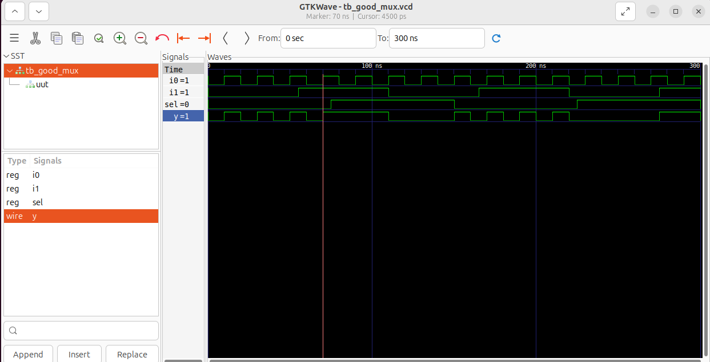

# Day 1: Introduction to Verilog RTL Design and Synthesis

Welcome to Day 1 of the RTL Workshop!  
Today, we will start building your digital design skills by writing Verilog code, simulating it with iverilog, and synthesizing designs using Yosys.  
This guide is hands-on, with clear steps and labs to help you get started.

---

## Table of Contents
- [Introduction to open source simulatior iverilog,Design and Test Bench](#introduction-to-open-source-simulator-iverilog)
- [Labs using Icarus Verilog and GTKWave](#labs-using-icarus-verilog-and-gtkwave)
- [Introduction to Yosys and Logic Synthesis](#introduction-to-yosys-and-logic-synthesis)
- [Labs using Yosys and Sky130 PDK](#labs-using-yosys-and-sky130-pdk)
- [Summary](#summary)

---

# Understanding Simulator, Design, and Testbench in Verilog

Understanding the roles of **Simulator**, **Design**, and **Testbench** is essential for anyone working with **Verilog RTL design**.  
These three components form the backbone of **digital design verification** before moving to synthesis or actual chip fabrication. 🚀

---

## 📌 1. Simulator
- A **simulator** is a tool that **mimics the behavior of your digital circuit** before it’s built in hardware.  
- It helps you verify whether your Verilog design works as expected and debug issues in a safe, virtual environment.
- **`iverilog`** is the open source simulator we are using in our workshop

## ⚙️ 2. Design (DUT – Design Under Test)
- The **Design**, also called the **UUT (Unit Under Test)** or **DUT (Design Under Test)**, represents the **actual hardware logic**.
- Actual **verilog** code which describes how data flows and how operations are performed at the **Register Transfer Level (RTL)**.

## 🧪 3. Testbench
- Testbench is an environmental setup to apply stimulus(test_vectors) to design and check functionality.
- It supplies **inputs (stimulus)** to the DUT and monitors the **outputs (responses)**.
---
  

## 🔄 4. How simulator works
- Simulator looks for the changes on the input signals.
- If there is no change to the input ➡️ no change to the output.
- Generates **waveform files (`.vcd`)** to visualize signals in tools like **GTKWave**.
---
  


# Labs using Icarus Verilog and GTKWave
This section covers **hands-on simulation labs** using  [**Icarus Verilog (iverilog)**](http://iverilog.icarus.com/) for compiling and simulating Verilog designs and  [**GTKWave**](http://gtkwave.sourceforge.net/) for waveform analysis.  

---

## 📂 Step 1: Clone the Workshop Repository
We will use the official **Sky130 RTL Design and Synthesis Workshop** repository as a reference.

> **Repository Link:** [sky130RTLDesignAndSynthesisWorkshop](https://github.com/kunalg123/sky130RTLDesignAndSynthesisWorkshop.git)

Run the following command in your terminal:

```bash
git clone https://github.com/kunalg123/sky130RTLDesignAndSynthesisWorkshop.git
```


## 🛠️ Step 2: Install required tools
Make sure you have the following tools installed on your system:
- Icarus Verilog (iverilog)
- GTKWave
- Yosys (for synthesis labs later)
- I have already installed these tools for detailed installation steps, check my [tool installtion instructions](https://github.com/SureshMadugundu/RISC-V_Reference_SOC_Tapeout_Program/blob/main/Week0/Task-2%3A%20Tools%20Installation%20Instructions.md).
## ▶️ Simulate the Design
1️⃣ Compile Design and Testbench Using Icarus Verilog

Run the following command to compile your design and testbench:
```bash
iverilog <design_file.v> <testbench_file.v> -o output.out
```
- <design_file.v> → Your Verilog design file (DUT)
- <testbench_file.v> → The testbench file to validate the design
- -o output.out → Output file generated by Icarus Verilog(If you don't specify output file name, by default a.out is generated)

  

2️⃣ Execute the simulation

Run the following command to execute the simulation
```bash
./output.out
```
This generates a .vcd file (Value Change Dump) containing all signal transitions during simulation.


3️⃣View Waveforms in GTKWave

GTKWave will launch, allowing you to inspect signals, debug issues, and verify your design's behavior.

```bash
gtkwave tb_good_mux.vcd
```



