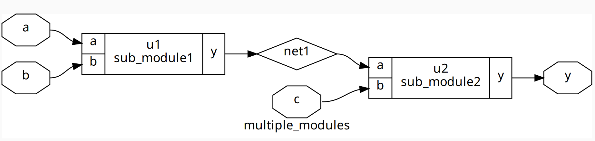
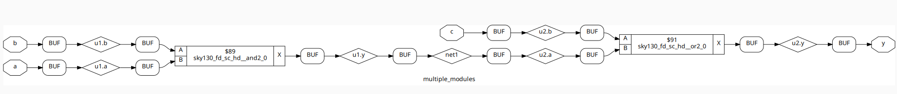
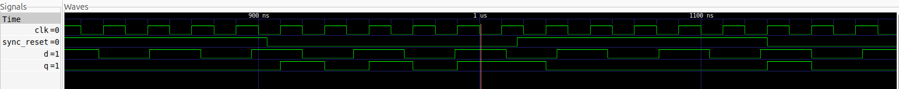
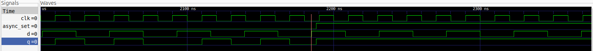
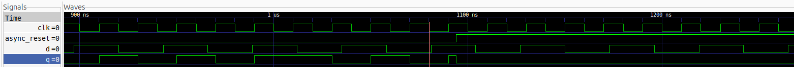
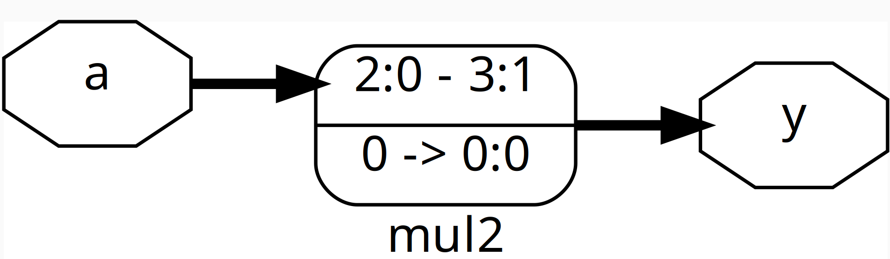
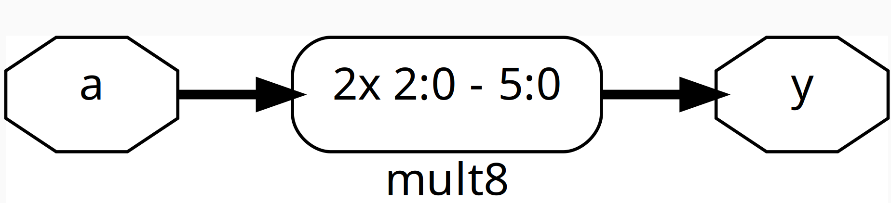

# Day 2: Timing Libraries, Hierarchical vs Flat Synthesis & Efficient Flip-Flop Coding Styles

Welcome to **Day 2** of the **RISC-V Reference SoC Tapeout Program**!  
Today's focus is on understanding **timing libraries**, exploring **synthesis strategies**, and learning **efficient flip-flop coding styles** to design optimized digital circuits.

---

## 📚 Topics for Today
- [Introduction to Timing Libraries (`.lib` files)](#-introduction-to-timing-libraries)
- [Hierarchical vs Flat Synthesis](#-hierarchical-vs-flat-synthesis)
- [Efficient Flip-Flop Coding Styles & Optimizations](#-efficient-flip-flop-coding-styles--optimizations)

---

## ⏱ Introduction to Timing Libraries

Timing libraries (`.lib` files) are **essential files** used by synthesis tools to:

- Provide **timing, power, and area** information for each standard cell.
- Enable **accurate synthesis and timing analysis**.
- Define how gates and flip-flops behave under **different PVT conditions**.

These libraries are critical for ensuring that designs meet performance and power targets across all operating conditions.

---

### Understanding PVT (Process, Voltage, Temperature)

**PVT** represents the three **critical variables** that affect chip behavior and timing:

- **Process (P):**  
  Variations in semiconductor manufacturing can result in:
  - **Fast (`ff`)**, **Slow (`ss`)**, or **Typical (`tt`)** transistor performance.

- **Voltage (V):**  
  The operating voltage of the circuit.
  - Higher voltage → **faster switching**, but **increased power consumption**.  
  - Lower voltage → **reduced power**, but **slower performance**.

- **Temperature (T):**  
  Affects transistor speed and leakage.  
  - Higher temperature → **slower operation** due to increased resistance.  
  - Lower temperature → **faster operation** but potential reliability issues.

#### **Example: Decoding `tt_025C_1v80` in the SKY130 PDK**

| Factor            | Description                       | Example |
|-------------------|-----------------------------------|---------|
| **Process (P)**   | Fabrication variations in transistors. | `tt` = Typical |
| **Voltage (V)**   | Power supply voltage level.       | `1v80` = 1.8V |
| **Temperature (T)** | Operating temperature in °C.      | `025C` = 25°C |

> **Why PVT is Important:**  
> - Ensures the circuit functions correctly under **all possible operating conditions**.  
> - Identifies **worst-case** and **best-case timing scenarios** for robust and reliable chip design.

---

## 🏗 Hierarchical vs Flat Synthesis

Synthesis is the process of converting **RTL (Register Transfer Level)** code into a **gate-level netlist**.  
There are two main approaches:

---

### **Hierarchical Synthesis**
- The design is **divided into modules**, and **each module is synthesized separately**.
- Easier to **debug**, **understand**, and **reuse** in other designs.
- Slightly **less optimized**, but highly **scalable** for **large SoCs**.

**Example:**  
Hierarchical synthesis netlist for [multiple_modules.v](./multiple_modules.v):

---

### **Flat Synthesis**
- The entire design is **flattened into a single module** before synthesis.
- Allows **maximum optimization** for **performance and area**.
- Harder to **debug**, with **less reusability**.

**Example:**  
Flat synthesis netlist for [multiple_modules.v](./multiple_modules.v):

---

### **Comparison Table**

| Aspect            | Hierarchical Synthesis | Flat Synthesis |
|-------------------|------------------------|----------------|
| **Debugging**     | Easier (module-wise)   | Harder |
| **Optimization**  | Moderate               | Higher |
| **Reusability**   | High                   | Low |
| **Best Use Case** | Large complex SoCs     | Small designs |

---

## 🔁 Efficient Flip-Flop Coding Styles & Optimizations

Flip-flops are **sequential logic elements** used to **store data** in synchronous circuits.  
Writing flip-flop RTL **efficiently** is crucial for:
- Reducing **power consumption** and **chip area**.
- Improving **timing performance**.
- Avoiding **unintended latches** or glitches.

---

### **Synchronous vs Asynchronous Reset**

| Feature          | Synchronous Reset | Asynchronous Reset |
|------------------|-------------------|--------------------|
| **Reset Action** | Triggered **only on clock edge** | Triggered **immediately** |
| **Timing Control** | Easy to manage and safe for synthesis | Harder to control |
| **Use Case**     | Preferred for synthesis and stable designs | Emergency or power-on reset |

---

## 🧾 Example Flip-Flop Implementations

Below are the flip-flop designs explored in this lab, along with their descriptions and sample outputs.

---

### 1️⃣ D Flip-Flop with **Synchronous Reset**

**Description:**  
This flip-flop **resets the output (`q`) to 0**, but **only on the rising edge of the clock**, making it predictable and stable for synthesis tools.

- **Waveform** for [dff_syncres.v](./dff_syncres.v):

---

### 2️⃣ D Flip-Flop with **Asynchronous Set**

**Description:**  
This flip-flop **immediately sets the output (`q`) to 1** when the `async_set` signal is asserted, independent of the clock signal.  
Commonly used for **global initialization** where certain registers must start in a known state.

- **Waveform** for [dff_async_set.v](./dff_async_set.v):

---

### 3️⃣ D Flip-Flop with **Asynchronous Reset**

**Description:**  
This flip-flop **immediately resets the output (`q`) to 0** when the `async_reset` signal is asserted, independent of the clock signal.  
Often used for **emergency reset scenarios**, such as power-on resets.

- **Waveform** for [dff_asyncres.v](./dff_asyncres.v):

---

### **Quick Summary**

| Type                  | Key Feature                          | Common Use Case |
|-----------------------|--------------------------------------|----------------|
| **Asynchronous Set**  | Output set immediately               | Global initialization |
| **Asynchronous Reset**| Output reset immediately             | Emergency reset, power-on reset |
| **Synchronous Reset** | Reset only on clock edge             | Stable, predictable designs |

---

### 🔧 Interesting Optimizations: Multiply by 2 and 9

In this lab, we explore **simple RTL optimizations** using constant multipliers. These examples demonstrate how synthesis tools handle multiplication efficiently.

---

#### 1️⃣ Multiply by 2

- **Purpose:** Multiply a 3-bit input by 2  
- **Optimization Insight:** Multiplying by 2 requires **no special multiplier hardware**.  
  - The output is generated by **appending a 0 to the least significant bit**, effectively a **left shift by 1**.  
  - The netlist shows that the synthesizer implements this with **wiring and simple logic**, not a full multiplier.  
- **Gate-level netlist** for [mul2.v](./mul2.v)  
  

---

#### 2️⃣ Multiply by 9

- **Purpose:** Multiply a 3-bit input by 9  
- **Optimization Insight:** Multiplying by 9 is equivalent to **(8 × a) + a**.  
  - The synthesizer implements **8 × a as a left shift by 3 bits**, then adds the original value.  
  - No dedicated multiplier hardware is used; only **adders and wiring**.  
- **gate-level netlist** for [mult8.v](./mult8.v)  
  

---
 ***The netlists confirm that these optimizations **save area and reduce complexity** in the final design.***

## 📝 Summary
- **Timing libraries** provide essential data for accurate synthesis and timing closure.
- **PVT variations** ensure reliable design across all operating conditions.
- **Hierarchical synthesis** improves reusability and debugging, while **flat synthesis** maximizes optimization.
- Efficient **flip-flop coding styles** prevent glitches, reduce area, and improve performance.
- Use **synchronous resets** wherever possible for predictable and safe synthesis.  
- **Asynchronous resets/sets** are reserved for exceptional cases like power-on initialization or fault recovery.
- Multiplying by powers of 2 → **shift operation, zero hardware cost**.  
- Multiplying by constants like 9 → use **shift + add**, which is more efficient than generic multiplication.

