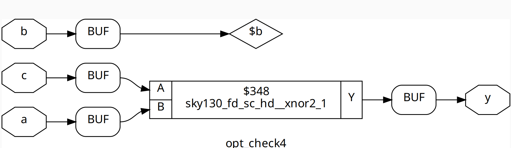
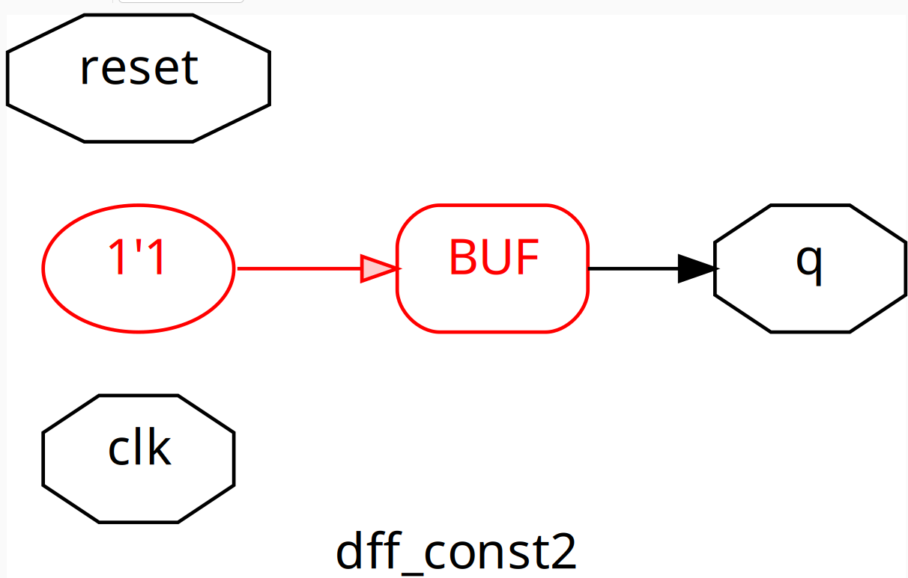

# Day 3 - Combinational and Sequential Optimizations

---

## **Welcome Message**
Welcome to **Day 3** of this workshop!  
Today, we will focus on the **optimization of combinational and sequential circuits**, introducing techniques to **enhance efficiency, performance, and resource utilization**.  
By the end of this session, you'll not only understand key optimization concepts but also **apply them through hands-on labs** to strengthen your practical skills.

---

## **Agenda**
1. Introduction to Optimizations  
2. Combinational Logic Optimizations  
3. Sequential Logic Optimizations  
4. Sequential Optimizations for Unused Outputs  
5. Hands-on Labs  

---

## **1. Introduction to Optimizations**
Optimization in digital design focuses on improving **area**, **power**, and **timing** while **preserving the original functionality** of the circuit.

### **Why Optimizations Are Needed**
- Reduce **chip area** → lower manufacturing costs  
- Improve **performance** → higher clock frequency  
- Minimize **power consumption** → better energy efficiency  
- Ensure designs meet **timing constraints** and **resource limits**  

### **Types of Optimizations**
1. **Combinational Logic Optimization**  
   Simplifies Boolean logic and gates to reduce circuit complexity.
2. **Sequential Logic Optimization**  
   Improves design efficiency by optimizing registers, flip-flops, and FSMs.

---

## **2. Combinational Logic Optimizations**
Combinational optimization focuses on simplifying logic circuits **without changing their functionality**.

### **Common Techniques**

#### **a) Boolean Algebra Simplification**
- Apply Boolean laws to reduce logic expressions.
- Example: Y = A·B + A·B' → Y = A

#### **b) Constant Propagation**
- Replace expressions with constant values when inputs are fixed.
- If A = 1, then Y = A & B → Y = B

### **Labs on Combinational Logic Optimization**
In this lab, you will practice simplifying combinational circuits and observe how synthesis tools optimize designs.
#### **Lab-1: Simple Ternary Operation Optimization**
- **Verilog File:** [opt_check.v](./verilog_files/opt_check.v)
- Simplifies to: y = a & b
- Optimized Circuit: AND gate
- **Gate level netlist:** 
#### **Lab-2: Ternary Condition with Constant 1**
- **Verilog File:** [opt_check2.v](./verilog_files/opt_check2.v)
- Simplifies to: y = a | b
- Optimized Circuit: OR gate
- **Gate level netlist:** 
#### **Lab-3: Nested Ternary Optimization**
- **Verilog File:** [opt_check3.v](./verilog_files/opt_check3.v)
- Step-by-Step Simplification:
  - c ? b : 0 → c & b
  - a ? (c & b) : 0 → a & c & b
  - Final Logic : y = a & b & c
- Optimized Circuit: 3-input AND gate
- **Gate level netlist:** 
#### **Lab-4: Multi-Level Nested Ternary with Inversion**
- **Verilog File:** [opt_check4.v](./verilog_files/opt_check4.v)
- This example demonstrates how synthesis tools handle multi-level nested ternary logic with conditional negations.
- Step-by-Step Simplification:
- Break Down the Expression y = a ? (b ? (a & c) : c) : !c
    - If a = 1: y = (b ? (a & c) : c)
    - If a = 0: y = !c
- Simplify the Inner Ternary (b ? (a & c) : c):
    - When b = 1 → (a & c)
    - When b = 0 → c
    - Since a = 1 in this outer branch, substitute a = 1:
    - b ? (1 & c) : c → b ? c : c
    - This always simplifies to c, because whether b is 0 or 1, the result is just c.
- Simplify the Outer Ternary:
  - The entire equation now becomes: y = a ? c : !c
- Final Simplified Logic:
  - This represents a 2-to-1 multiplexer with a as the selector : y = (a & c) | (!a & !c)
  - Which is the XNOR operation : y = ~(a ^ c)
- Final Logic Gate: A single XNOR gate between a and c.
- **Gate level netlist:** 
  
## **3. Sequential Logic Optimizations**
Sequential optimization targets **registers**, **flip-flops**, and **state machines** to improve performance and efficiency.

### **Goals**
- Reduce **register count**  
- Improve **timing performance** by balancing paths  
- Lower **dynamic power consumption**

### **Techniques**

#### **a) Retiming**
- Moving flip-flops across combinational logic **without altering functionality**.
- Helps balance **setup and hold times** and improve clock speed.

#### **b) State Minimization (FSM Optimization)**
- Merge **equivalent states** in finite state machines (FSMs) to reduce complexity.

#### **c) Clock Gating**
- Save power by **disabling clocks** for idle registers.

#### **d) Register Sharing**
- Reuse registers when their outputs are **not active simultaneously**.

### **Labs on Sequential Logic Optimization**
These labs will help you understand how synthesis tools optimize sequential designs.

#### **Lab-1: Flip-Flop Driving a Constant Value**
- **Verilog File:** [dff_const.v](./verilog_files/dff_const.v)
This example shows how synthesis tools handle **sequential logic that always drives a constant value**.
- **Waveform :** 
- Initial Behavior
  - On reset : q = 0
  - On first clock edge after reset : q = 1 And stays at 1 forever regardless of future clock cycles.
- Observation : The flip-flop simply acts as a constant driver of logic 1, except during reset.
- The synthesis tool realizes:
    - After reset, the flop always outputs 1.
    - There is no need for an actual flip-flop, as this value never changes dynamically.
- Final Hardware Implementation
  - reset input is completely ignored.
  - Synthesis tool ties q directly to VCC (logic high).
- **Gate level netlist:** 
  
#### **Lab-2: Flip-Flop Always Driving Constant `1`**
- **Verilog File:** [dff_const1.v](./verilog_files/dff_const1.v)
This example demonstrates how a sequential element can be **completely optimized away** when it always outputs the same constant.
- **Waveform :** 
- Initial Behavior
  - Regardless of reset or clock: q is always 1.
  - Unlike Lab 1, here the reset does not create a transient 0, so the output is constant from the beginning.
  - Step-by-Step Optimization
- Observation:
  - Flip-flop always outputs 1.
  - Clock and reset do not affect the final value.
- Synthesis Optimization:
  - The tool removes the flip-flop entirely.
  - The output is replaced with a direct constant connection to logic high (VCC).
- **Gate level netlist:** 
## **4. Sequential Optimizations for Unused Outputs**
Unused outputs waste **area and power** if left unoptimized.

### **Lab-1 : Counter with Only LSB Used**
- **Verilog File:** [counter_opt.v](./verilog_files/counter_opt.v)
- Initial Design
  - count is a 3-bit register, incrementing on each clock cycle.
  - Only bit 0 (count[0]) is connected to the output q.
- Synthesis Analysis:
  - Bits count[1] and count[2] do not affect any output or downstream logic.
- Tool Decision:
  - Unused bits are completely removed from hardware.
  - The design is simplified to a 1-bit toggle flip-flop.
- Result : Only one flip-flop remains instead of three.
- **Gate level netlist:** 
### **Lab-2 : Counter Compared to a Constant**
- **Verilog File:** [counter_opt2.v](./verilog_files/counter_opt2.v)
- Initial Design
  - count is a 3-bit counter.
  - Output q only depends on whether the entire 3-bit count equals 4 (100).
- Synthesis Analysis:
  - Since q depends on all three bits, none of the counter bits are unused.
  - Optimization only focuses on implementing the comparator efficiently.
- Tool Decision:
  - The comparator (count == 3'b100) is directly implemented using minimal gates.
  - The counter itself cannot be reduced because every bit contributes to q.
- Result : 3 flip-flops remain for count, Comparator minimized
- **Gate level netlist:** 

---
