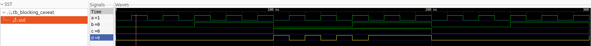
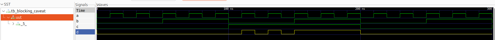

# Day 4 - GLS, Blocking vs Non-Blocking, and Synthesis-Simulation Mismatch

---

## **Welcome to Day 4!**
Today, we will dive into **Gate-Level Simulation (GLS)** and understand how mismatches occur between **synthesis and simulation**.  
We will also explore **blocking (`=`)** vs **non-blocking (`<=`)** assignments in Verilog and how improper usage can lead to **unexpected simulation behavior**.

Hands-on labs will guide you through **real-world debugging scenarios**, showing how synthesis tools optimize designs and how to detect mismatches early.

---

## **Agenda**
1. Introduction to GLS (Gate-Level Simulation)  
2. Understanding Synthesis-Simulation Mismatch  
3. Blocking vs Non-Blocking Statements in Verilog  
4. Labs on GLS and Synthesis-Simulation Mismatch due to missing sensitivity list 
5. Labs on Synth-Sim Mismatch caused by Blocking Assignments  


---

## **1. Introduction to GLS (Gate-Level Simulation)**

### **What is GLS?**
Gate-Level Simulation is the **post-synthesis simulation** of your design using:
- **Netlist generated by synthesis tool**
- **Standard cell libraries**

It verifies that the **synthesized hardware behavior matches the RTL simulation**, ensuring no functionality is lost during synthesis.

---

### **Why GLS is Important**
- Detect **synthesis-simulation mismatches** early.
- Verify **timing violations** like setup and hold time issues.
- Check **reset and initialization logic** in the actual gate-level design.
- Ensure the final **netlist matches design intent**.

---

### **GLS Workflow**
1. Write RTL → Simulate → Verify behavior  
2. Synthesize design → Generate netlist  
3. Simulate **netlist with same testbench** → Compare outputs  
4. Debug mismatches if found

---

## **2. Understanding Synthesis-Simulation Mismatch**

A **synthesis-simulation mismatch** occurs when **RTL simulation output ≠ Gate-level simulation output**

### **Common Causes:**
1. **Uninitialized signals**  
   - RTL sim may start with `X` values while synthesis might assume `0` or optimized logic.
2. **Incorrect use of blocking (`=`) vs non-blocking (`<=`) statements**  
   - Leads to race conditions and unexpected sequential behavior.
3. **Inconsistent sensitivity lists** in `always` blocks.
4. **Latch inference** due to incomplete assignments.
5. **Tool optimizations** removing signals that don't affect outputs.

---

### **Impact of Mismatches**
- Functional errors that only appear **after hardware synthesis**.
- Debugging late in the flow can cost **time and money**.
- Harder to reproduce issues since **hardware behaves differently than RTL simulation**.

---

## **3. Blocking vs Non-Blocking Statements**

### **Inside `always` Block**
Verilog has two types of procedural assignments inside an `always` block:

---

### **Blocking (`=`)**
- **Executes sequentially** in the **exact order** written.
- The **first statement is evaluated** before moving to the **second statement**.
- Similar to **software programming assignment**.

Example:
```verilog
always @(posedge clk) begin
    a = b;    // Executed first
    c = a;    // Uses the new value of 'a'
end
```
### **Non-Blocking (`<=`)**
- All RHS expressions are evaluated in parallel, then assignments are updated at the same time.
- Used for sequential logic like flip-flops.

Example:
```verilog
always @(posedge clk) begin
    a <= b;    // Evaluated in parallel
    c <= a;    // Uses old value of 'a'
end
```
## **4. Labs on GLS and Synthesis-Simulation Mismatch due to missing sensitivity list**

### GLS for ternary_operator(MUX)
- Simulation waveform before synthesis:
  
- Synthesis of the [ternary_operator.v](./verilog_files/ternary_operator.v):
    
- Command to generate GLS for synthesized MUX : [ternary_operator.v](./verilog_files/ternary_operator.v)
  ```bash
  iverilog <path to primitives.v> <path to sky130_fd_sc_hd.v> <design.v> <test_bench.v>
  ```
- Simulation After Synthesis (GLS):
    
    
### Synthesis-Simulation Mismatch due to missing sensitivity list
```verilog
module bad_mux(input i0, input i1, input sel, output reg y);
always @(sel) begin    // ❌ Incomplete sensitivity list
    if (sel)
        y <= i1;
    else 
        y <= i0;
end
endmodule
```
**Simulation Observation:** If i0 or i1 changes without a change in sel, output does NOT update.
**Fix:**
```verilog
always @(*) begin      // ✅ Correct combinational design
    if (sel)
        y = i1;
    else 
        y = i0;
end
```
- Simulation waveform before synthesis:
  
- Synthesis of the [bad_mux.v](./verilog_files/bad_mux.v):
    
- Simulation After Synthesis (GLS):
    
**Learning Outcome:**
- Understand why synthesis uses hardware gates, which always react to changes.
- Recognize simulator behavior mismatch due to missing sensitivity.
  
## **5. Labs on Synth-Sim Mismatch caused by Blocking Assignments**
- Blocking assignments inside a combinational always block can produce unexpected results due to execution order.

Code:
```verilog
module blocking_caveat (
    input a, 
    input b, 
    input c, 
    output reg d
);
reg x;

always @(*) begin
    d = x & c;      // Uses 'x' BEFORE it is updated
    x = a | b;      // 'x' updated later
end
endmodule
```
**Problem Explanation:**

- ***In simulation:***
  - d uses the old value of x because the blocking assignment updates x only after the statement is executed.
  - This may not match actual synthesized hardware, leading to mismatches.

- ***In synthesis:***
  - Hardware treats this as parallel logic, so both statements evaluate together.

**Optimized Fix:**
```verilog
module blocking_caveat_fixed (
    input a, 
    input b, 
    input c, 
    output reg d
);
reg x;

always @(*) begin
    x = a | b;      // Update 'x' first
    d = x & c;      // Now uses updated 'x'
end
endmodule
```

**Alternative Using Continuous Assignment:**
```verilog
assign x = a | b;
assign d = x & c;
```

- Simulation Before Synthesis:


- Synthesis of the [blocking_caveat.v](./verilog_files/blocking_caveat.v):


- Simulation After Synthesis (GLS):


**Learning Outcome:**
- Blocking assignments in combinational logic must follow proper ordering.
- If ordering is difficult to maintain, use continuous assignments or break logic into smaller always blocks.


**Final Takeaways**

- GLS validates post-synthesis designs before fabrication.

- Always:
  - Use non-blocking (<=) for clocked always blocks.
  - Use blocking (=) in always @(*) for combinational logic, but order statements carefully.
  - Use @(*) to avoid simulation mismatches.


