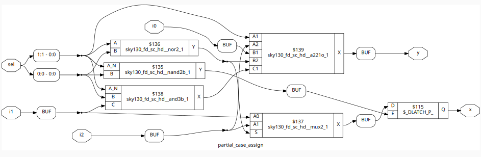

# Day 5 - Optimization in Synthesis

---
Welcome to **Day 5 of Workshop!** 🎉

Today, we will focus on **optimization techniques in synthesis** and learn how different coding styles in Verilog impact **hardware generation** and **resource utilization**.  

We will also dive deep into:
- Understanding Optimization in Synthesis
- `if` and `case` constructs,
- Labs on **"Incomplete `if case`"**
- Labs on **"Incomplete overlapping Case"**
- for loop and for generate
- Labs on **"for loop"** and **"for generate"**

## **1. Optimization in Synthesis**

### **What is Synthesis Optimization?**
Synthesis optimization is the process where the synthesis tool improves RTL to generate **area-efficient**, **power-efficient**, and **performance-optimized** gate-level hardware.

---

### **Goals of Optimization**
| **Goal**        | **Description** |
|-----------------|-----------------|
| **Area Optimization** | Reduce the number of logic gates and flip-flops. |
| **Speed Optimization** | Improve timing performance and reduce propagation delay. |
| **Power Optimization** | Reduce dynamic and static power consumption. |

---

### **Why Optimization Matters**
- Poor RTL coding leads to:
  - Unnecessary logic.
  - **Latch inference** (unintended memory elements).
  - Increased area and power.
- Optimized coding ensures:
  - Predictable hardware behavior.
  - Efficient designs for FPGAs and ASICs.

---

## **2. `if` and 'case' constructs in Verilog**

### **Understanding `if` Constructs**
- `if` statements are **priority-based**.
- In synthesis, they map to **priority encoders**.

**Example:**
```verilog
if (cond1)
    y = 2'b01;
else if (cond2)
    y = 2'b10;
else
    y = 2'b00;
```

**Common Issue: Incomplete `if`**
- Problem: If all possible conditions are not covered, the synthesis tool infers a latch to hold the previous value.
- Latches are undesirable in synchronous designs.

**Incorrect Code:**
```verilog
always @(*) begin
    if (enable)
        y = data;   // ❌ No else condition → latch inferred
end
```

**Optimized Code:**
```verilog
always @(*) begin
    if (enable)
        y = data;
    else
        y = 0;      // ✅ Fully specified
end
```
### **Understanding case Statements**
- `case` is used for multi-way selection.
- In synthesis, it maps to multiplexers.

**Example:**
```verilog
case (sel)
    2'b00: y = 0;
    2'b01: y = 1;
    2'b10: y = 2;
    2'b11: y = 3;
endcase
```
**Common Issue: Incomplete or Overlapping case**
- Incomplete case : Not all input possibilities are handled → leads to latch inference.
- Overlapping case : Multiple case items match simultaneously → leads to priority ambiguity.
- 

## **Lab-1 : Incomplete `if`**
Understand how an incomplete if statement can infer latches during synthesis and cause unwanted behavior in hardware.

Verilog Code – [incomp_if.v](./verilog_files/incom_if.v)
```verilog
module incomp_if (
    input i0, 
    input i1, 
    input i2, 
    output reg y
);
always @(*) begin
    if (i0)
        y <= i1;    // ❌ No else statement → latch inferred
end
endmodule
```
**Explanation:**
- The always @(*) block models combinational logic.
- When i0 = 1, the output y is assigned the value of i1.
-  **Problem:**
  - When i0 = 0, there is no assignment to y, so the synthesis tool infers memory (a latch) to hold the previous value of y.
  - This unintended latch can cause timing issues and unpredictable behavior in your circuit.

**Observations**
 - Before Synthesis (RTL Simulation):
   
   

  The RTL simulation behaves as if y simply holds its last value when i0 = 0.

- Gate level netlist:
  
  

- After Synthesis (GLS Simulation):
  
   

    A latch is introduced, and the waveform now shows glitches or unexpected behavior.
  

## **Lab-2 : Incomplete if-else if**

Demonstrate how chained if-else if statements, when incomplete, lead to latch inference and create unintended memory in your design.

Verilog Code – [incomp_if2.v](./verilog_files/incomp_if2.v)
```verilog
module incomp_if2 (
    input i0, 
    input i1, 
    input i2, 
    input i3, 
    output reg y
);
always @(*) begin
    if (i0)
        y <= i1;      // When i0 is 1 → assign i1
    else if (i2)
        y <= i3;      // When i0 is 0 and i2 is 1 → assign i3
    // ❌ Missing else statement → latch inferred when both i0=0 and i2=0
end
endmodule
```
**Explanation:**
- When i0 = 1, y is assigned the value of i1.
- When i0 = 0 and i2 = 1, y is assigned the value of i3.
- Problem:
  - When i0 = 0 and i2 = 0, there is no assignment to y.
  - Synthesis tool infers a latch to store the previous value of y.

**Mismatch Between RTL and GLS:**
- RTL simulation appears correct, as the simulator simply keeps the previous value of y.
- Post-synthesis GLS shows glitches due to the actual physical latch being inferred.

**Observations**
- Before Synthesis (RTL Simulation):
  
  

  The output y holds its previous value whenever i0=0 and i2=0.
  Looks fine, but misleading!

- Gate level netlist:
  
  

- After Synthesis (GLS Simulation):
  
  
  The latch causes glitches and timing hazards visible in GLS waveforms.


## **Lab-3 : Complete Case Statement**
 
Understanding how using a complete case statement ensures that no latches are inferred, leading to clean, predictable hardware.

Verilog Code – [comp_case.v](./verilog_files/comp_case.v)

```verilog
module comp_case (
    input i0, 
    input i1, 
    input i2, 
    input [1:0] sel, 
    output reg y
);
always @(*) begin
    case (sel)
        2'b00 : y = i0;      // Select input i0
        2'b01 : y = i1;      // Select input i1
        default : y = i2;    // ✅ Covers all other cases → no latch inferred
    endcase
end
endmodule
```

**Explanation:**
- sel is a 2-bit select line:
  - 00 → y = i0
  - 01 → y = i1
  - Other combinations (10 or 11) → y = i2
- Default case ensures completeness:
  - Every possible value of sel has a defined output.
  - This prevents latch inference during synthesis.

**Observations**
- Before Synthesis (RTL Simulation):
  
  

- Gate level netlist:
  
  

- After Synthesis (GLS Simulation):
  
  

## **Lab-4 : Incomplete Overlapping Case with Wildcards**

Understand the risks of using wildcards (?) in case statements (casez or casex), and how incomplete or overlapping cases can lead to unpredictable synthesis behavior and simulation mismatches.

Verilog Code – [bad_case.v](./verilog_files/bad_case.v)
```verilog
module bad_case (
    input i0, input i1, input i2, input i3,
    input [1:0] sel,
    output reg y
);
always @(*) begin
    case (sel)
        2'b00: y = i0;      // Select input i0
        2'b01: y = i1;      // Select input i1
        2'b10: y = i2;      // Select input i2
        2'b1?: y = i3;      // ❌ Wildcard matches 10 or 11 → overlapping case
    endcase
end
endmodule
```

**Explanation:**
- The select line sel is 2 bits wide (00, 01, 10, 11).
- The 2'b1? pattern uses ? as a wildcard, meaning:
  - 10 or 11 both match this condition.
- Problem: Overlap occurs because:
  - 2'b10 matches two lines:
    - Explicit case: 2'b10: y = i2;
    - Wildcard case: 2'b1?: y = i3;
  - This causes ambiguous behavior, as synthesis and simulation may prioritize differently.

**Why This is Dangerous:**

| Issue	 | Impact |
|--------|--------|
| Overlapping cases |	Tools may resolve ambiguity differently → simulation vs synthesis mismatch.|
| Missing default branch |	When sel = 11, behavior is completely dependent on synthesis tool interpretation.|
| Use of wildcards (?)	| Hides bugs during RTL simulation, leading to difficult-to-debug GLS issues.|

**Obseravtaions**

- Before Synthesis (RTL Simulation):
  - RTL will follow the first matching case, meaning:
    - For sel=10, y = i2.
    - For sel=11, y = i3.
      
  

- Gate level netlist:
  
  

- After Synthesis (GLS Simulation):
  - Synthesis tools may optimize logic differently, possibly giving:
  - For sel=10, ambiguous output (depends on optimization rules).
    
  
  
  - Mismatch between RTL and gate-level simulation.
 
## **Lab-5 : Partial Case Assignment**

Learn how partially assigning outputs in case statements can infer unintended latches, leading to incorrect synthesis results and mismatches between RTL and GLS.

Verilog Code – [partial_case_assign.v](./verilog_files/partial_case_assign.v)

```verilog
module partial_case_assign (
    input i0, input i1, input i2,
    input [1:0] sel,
    output reg y, output reg x
);
always @(*) begin
    case (sel)
        2'b00: begin
            y = i0;     // ✅ Both outputs are assigned
            x = i2;
        end
        2'b01: y = i1;  // ❌ Only 'y' is assigned → 'x' holds previous value (latch inferred)
        default: begin
            x = i1;
            y = i2;
        end
    endcase
end
endmodule
```

**Problem Explanation:**
- Signal x is not assigned in the 2'b01 branch:
  - When sel = 01, x retains its previous value, causing the synthesis tool to infer a latch for x.
- Why it matters:
  - In combinational logic (always @(*)), every output must be fully assigned in every path to avoid memory elements.
  - If even one signal is left out in a branch, the synthesis tool assumes you intended to store its value.


**Observations**
- Before Synthesis (RTL Simulation):
  
  
  
  The output x appears stable, holding its last value when sel = 01.

- Gate level netlist:
  
  

- After Synthesis (GLS Simulation):
  
  
  
  A latch is added for x, causing glitches or unexpected behavior in real hardware.

## `for` loops and `for generate` loops

### `for` Loops in Verilog
- Avoid repetitive code by looping over repetitive hardware structures.
- Synthesizable for loops are unrolled during synthesis.
- Used inside `always` block.
  
### `for generate` Loops in Verilog
- for generate is used when repeating hardware at compile time, not during runtime.
- Allows parametric hardware designs.
- Used outside `always` block

## **Lab-6 Using for Loop in RTL Design**

Understand how to use a for loop inside an always block to create iterative hardware structures, such as multiplexers, and how synthesis tools unroll these loops into combinational logic.

Verilog Code – [mux_for.v](./verilog_files/mux_for.v)
```verilog
module mux_for (
    input i0, input i1, input i2, input i3,
    input [1:0] sel,
    output reg y
);
    // Combine inputs into a single bus for easy indexing
    wire [3:0] i_int;
    assign i_int = {i3, i2, i1, i0};

    integer k;  // Loop variable

    always @(*) begin
        for (k = 0; k < 4; k = k + 1) begin
            if (k == sel)
                y = i_int[k];
        end
    end
endmodule
```

**Explanation:**

- Input Packing:
  - The four inputs i0, i1, i2, and i3 are combined into a 4-bit vector i_int for easier indexing: ```i_int = {i3, i2, i1, i0}```
  - Example: ```i3=1, i2=0, i1=1, i0=0 → i_int = 4'b1010```
- For Loop Behavior:
  - The loop iterates from 0 to 3.
  - When the loop index k equals the sel value, the output y is assigned the corresponding bit from i_int.
- Example Operation:

  |sel	| y Output|
  |-----|---------|
  |2'b00|	i0|
  |2'b01	|i1|
  |2'b10	|i2|
  |2'b11	|i3|

**Obseravtions**
- Before Synthesis (RTL Simulation):
  
   
   
    RTL behaves like a 4-to-1 multiplexer, selecting one of the inputs based on sel.


- Gate level netlist:
  
  

- After Synthesis (GLS Simulation):

  
  
    The synthesis tool unrolls the loop, creating parallel logic equivalent to a normal case statement.
    The hardware is identical to a standard multiplexer.


## **Lab-7 : Demultiplexer using Case and For Loop**

Understand how to implement an 8-to-1 demultiplexer in Verilog using both a case statement and a for loop inside an always block, and observe how both approaches produce the same hardware behavior.

Verilog Code – [demux_case.v](./verilog_files/demux_case.v)
```verilog
module demux_case (
    output o0, output o1, output o2, output o3,
    output o4, output o5, output o6, output o7,
    input [2:0] sel,
    input i
);
    reg [7:0] y_int;
    assign {o7, o6, o5, o4, o3, o2, o1, o0} = y_int;

    always @(*) begin
        y_int = 8'b0;
        case(sel)
            3'b000 : y_int[0] = i;
            3'b001 : y_int[1] = i;
            3'b010 : y_int[2] = i;
            3'b011 : y_int[3] = i;
            3'b100 : y_int[4] = i;
            3'b101 : y_int[5] = i;
            3'b110 : y_int[6] = i;
            3'b111 : y_int[7] = i;
        endcase
    end
endmodule
```

Verilog Code – [demux_for.v](./verilog_files/demux_for.v)
```verilog
module demux_for ( 
    output o0, output o1, output o2, output o3,
    output o4, output o5, output o6, output o7,
    input [2:0] sel,
    input i
);
    reg [7:0] y_int;
    assign {o7, o6, o5, o4, o3, o2, o1, o0} = y_int;
    integer k;

    always @(*) begin
        y_int = 8'b0;
        for (k = 0; k < 8; k = k + 1) begin
            if (k == sel)
                y_int[k] = i;
        end
    end
endmodule
```

**Explanation**
- Input and Output Mapping
- The demux takes a 3-bit select signal sel and a single input i.
- The output is 8 one-hot signals {o0, o1, ..., o7}.
- Internally, y_int stores the output bits and is assigned to outputs as:
    ```iverilog assign {o7, o6, o5, o4, o3, o2, o1, o0} = y_int;
    ```

**Case Statement Behavior**

- The case block explicitly maps each sel value to a corresponding output bit:
  - sel = 3'b000 → o0 = i
  - sel = 3'b001 → o1 = i
  - ...
  - sel = 3'b111 → o7 = i
- Only the selected output is set to 1; others remain 0.

**For Loop Behavior**

- A for loop iterates through all output bits 0–7.
- When the loop index matches sel, the corresponding bit is set to i.
- Functionally equivalent to the case statement, but more scalable for larger demuxes.

**Example Operation**

  |sel	|Output (o7..o0)|
  |-----|---------------|
  |3'b000|	0000000i0|
  |3'b001	|000000i1|
  |3'b010	|00000i2|
  |3'b111	|i7|

- For i = 1 and sel = 3'b010, the output o2 = 1, all others = 0.
- Both case and for produce the same one-hot output.

**Observations:**
- Before Synthesis (RTL Simulation):
  
    
    
    
  - Both modules behave as an 8-to-1 demultiplexer, selecting one output based on sel.
 
- Gate level netlist:
  
  
  
  

- After Synthesis (GLS Simulation):
  
    
    
    
  - The for loop is unrolled by the synthesis tool into parallel logic.
  - The hardware is identical to the case statement implementation.
 
## **Lab-8 : Using Generate For Loop in RTL Design (RCA Example)**

Understand how to use a generate-for loop in Verilog to instantiate repetitive hardware modules (like full adders) efficiently and how synthesis tools handle these loops to create combinational logic structures.

Verilog Code – [rca.v](./verilog_files/rca.v) , [fa.v](./verilog_files/fa.v)

**Explanation**
- **RCA Architecture**
  - The ripple-carry adder (RCA) adds two 8-bit numbers, producing a 9-bit sum.
  - Each full adder (FA) computes a single-bit sum and carry:
      ```bash
      sum[i] = num1[i] ⊕ num2[i] ⊕ carry_in[i]
      carry_out[i] = (num1[i] & num2[i]) | (carry_in[i] & (num1[i] ⊕ num2[i]))
      ```
**Generate For Loop Behavior**
- genvar i creates a loop variable for module instantiation.
- The loop instantiates full adders for bits 1 to 7.
- fa u_fa_1 instances are connected such that each FA uses the previous carry as input.
- Bit 0 FA is instantiated separately, with carry_in = 0.

**Advantages**
- Scalability: Easy to extend to N-bit adders by changing loop limits.
- Readability: Reduces repetitive code.
- Synthesis: The generate loop is unrolled by the synthesis tool into multiple full-adder instances.

**Operation Example**
  |num1|num2|sum|
  |----|----|---|
  |8'b00001101|8'b00000111|9'b00010100|
  
- Each bit is added with proper carry propagation.

- int_co stores internal carries, int_sum stores bitwise sums.

- sum[8] captures the final carry-out.

- This demonstrates how generate-for loops simplify iterative hardware instantiation in Verilog.

- Before Synthesis (RTL Simulation):
  
   
   
- Gate level netlist:
  
  

- After Synthesis (GLS Simulation):

  

  
